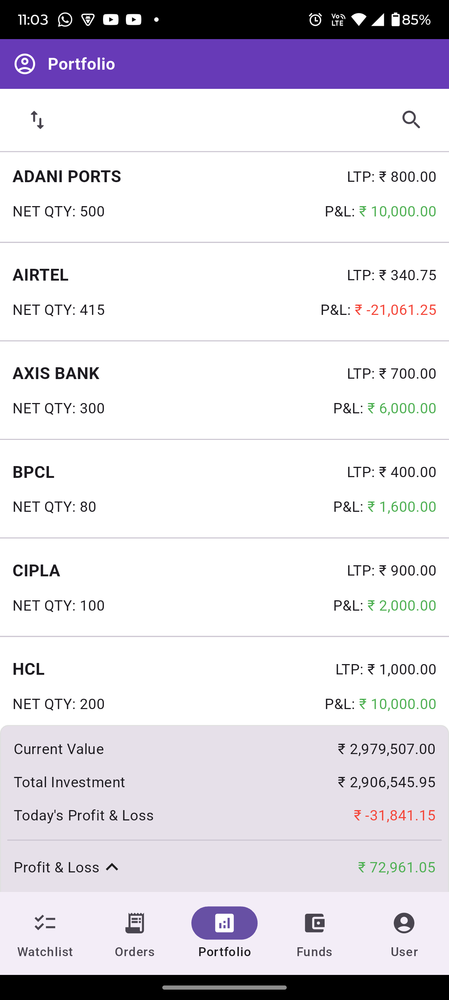
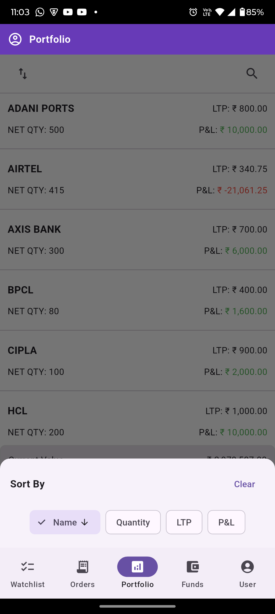

# 📱 flutter_sample

A beautifully structured Flutter application that simulates an investment portfolio management interface. Built using the **latest Flutter practices** and **clean architecture**, this project uses dummy data to showcase powerful features and optimized UI patterns.

> 🔧 Developed with scalability and maintainability in mind — perfect for learning, showcasing, or expanding further!

---

## ✨ Features

- ✅ Real-time summary of Current Value, Investment & Profit/Loss
- 🔍 Instant search & sorting across holdings
- 🔄 Pull-to-refresh to update holdings
- 🧩 Modular MVVM structure using `Provider`
- 💡 Minimized rebuilds for performance optimization
- 🌙 Dark & light theme compatibility
- 📱 Clean UI with responsive design

---

## 📸 Screenshots

| 📊 Portfolio Summary | 🔽 Sort Bottom Sheet |
|----------------------|---------------------|
|  |  |

---

## 🚀 Getting Started

### 📦 Clone the Repo

```bash
git clone https://github.com/kalpeshk95/flutter_sample.git
cd flutter_sample
```

### 🧰 Install Dependencies

```bash
flutter pub get
```

### ▶️ Run the App

```bash
flutter run
```

---

## 🧠 Architecture Overview

This project is based on **MVVM** with a **clean code separation** using `Provider` and `ChangeNotifier`.

```
lib/
├── core/             # Shared API & utility helpers
├── data/             # DTOs and Freezed models
├── repo/             # Repository abstractions and implementations
├── ui/
│   ├── screens/      # Feature-specific UI and ViewModels
│   ├── shared/       # Reusable widgets
│   └── utility/      # Extensions, constants
└── main.dart         # App entry point
```

---

## 📦 Key Dependencies

| Package             | Purpose                            |
|---------------------|-------------------------------------|
| `provider`          | State management                    |
| `go_router`         | Declarative navigation              |
| `json_serializable` | Code-gen for model serialization    |
| `freezed`           | Immutable data classes & unions     |
| `get_it`            | Dependency injection                |
| `dio`               | HTTP networking                     |

---

## 💬 Contributions Welcome

This project is still evolving. I would be **happy to collaborate** with developers who want to expand its scope or improve functionality. New features, code refactors, or even documentation help are all appreciated.

### To contribute:
1. **Fork** the repository
2. **Create a branch**: `git checkout -b feature/your-feature`
3. **Make your changes**
4. **Commit**: `git commit -m 'Add some feature'`
5. **Push**: `git push origin feature/your-feature`
6. **Open a Pull Request`

---

## 📚 Additional Resources

If you're new to Flutter, here are a few official resources to help you get started:

- [🚀 Write your first Flutter app](https://docs.flutter.dev/get-started/codelab)
- [🍳 Cookbook: Useful Flutter samples](https://docs.flutter.dev/cookbook)
- [📘 Flutter Documentation](https://docs.flutter.dev/): Full API reference and guides

