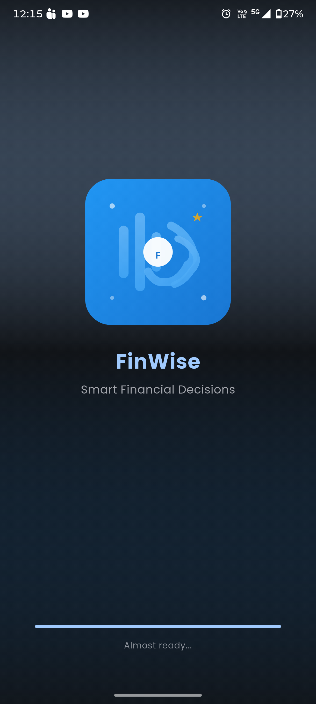
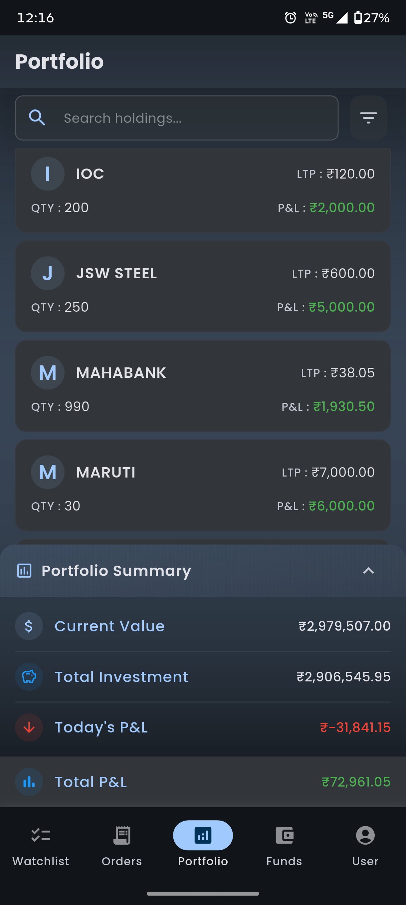
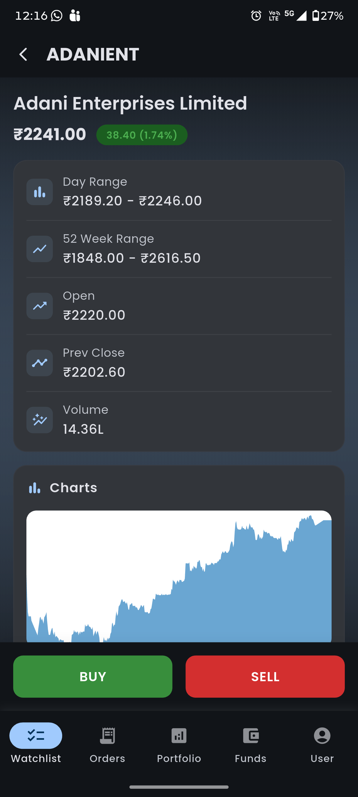
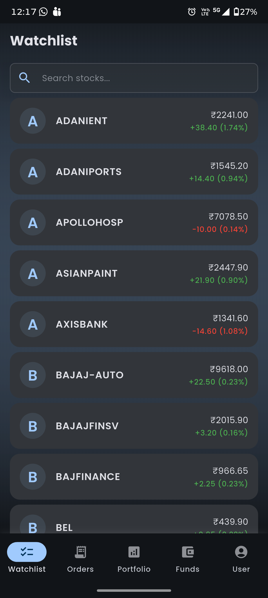
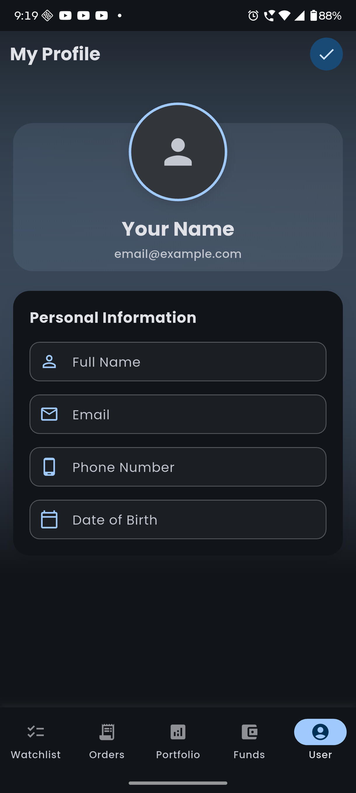
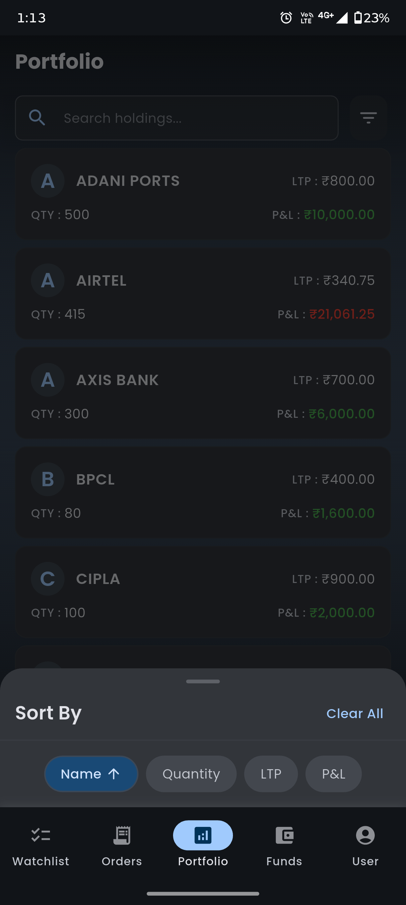
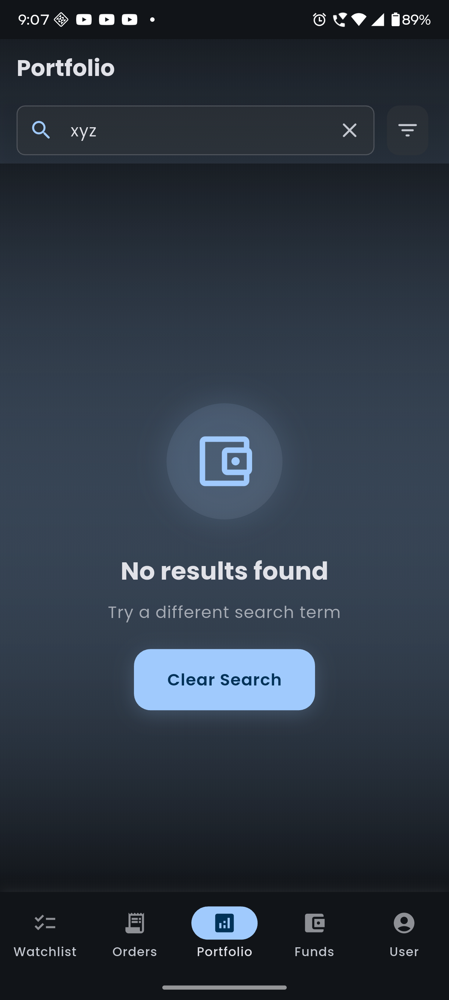

# 📱 FinWise - Smart Financial Decisions

<div align="center">

[](https://flutter.dev/)
[](https://dart.dev/)
[](https://opensource.org/licenses/MIT)
[](http://makeapullrequest.com)

</div>

A beautifully structured Flutter financial application that simulates an investment portfolio management interface. Built using the **latest Flutter practices**, **clean architecture**, and **optimized performance patterns**, this project uses **dummy data** to showcase powerful features and modern UI patterns.

> 🔧 **Note:** All data shown in this application is **simulated/dummy data** for demonstration purposes only. No real financial data or transactions are involved.
>
> 🚀 **FinWise** represents the perfect blend of financial intelligence and modern technology, developed with scalability and maintainability in mind!

---

## ✨ Features

### 📊 Portfolio Management
- ✅ Real-time summary of Current Value, Investment & Profit/Loss (using simulated data from NiftyMock.json)
- 📱 Responsive design that works on mobile and tablet
- 💾 All data is locally generated and simulated for demonstration
- 🌓 Built-in light and dark theme support
- 🎯 Smart financial insights and recommendations

### 🔍 Search & Filter
- 🔍 Instant search across all holdings
- 🎚️ Advanced filtering options
- 🔄 Pull-to-refresh to update holdings
- 📊 Advanced sorting capabilities

### 🛠️ Technical Highlights
- 🏗️ Modular MVVM architecture using `Provider`
- ⚡ **Performance Optimized** with 20-30% better rendering
- 🌓 Built-in support for both light and dark themes
- 🌐 Clean API layer with Dio for network calls
- 🔒 Secure storage for sensitive data
- 🧩 **Code Quality** with strict linting and safe operations
- 📱 **Modern UI** with FinWise branding and custom logo

---

## 🌓 Screenshots

| Splash Screen | Portfolio Summary | Stock Details | Watchlist |
|---|---|---|---|
|  |  |  |  |

| Profile | Filters | No Data |
|---|---|---|
|  |  |  |


*Note: All data shown in screenshots is simulated for demonstration purposes. The app features a complete light/dark theme system that respects the device's theme settings.*

---

## 🚀 Getting Started

### Prerequisites
- Flutter SDK (>=3.38.9)
- Dart SDK (>=3.5.4)
- Android Studio / VS Code with Flutter extensions
- Android Emulator or physical device

### 📦 Clone the Repository

```bash
git clone https://github.com/kalpeshk95/flutter_sample.git
cd flutter_sample
```

### 🧰 Install Dependencies

```bash
flutter pub get
```

### ▶️ Run the App

#### For Development
```bash
# Run in debug mode
flutter run

# Run with flavor (development/staging/production)
flutter run --flavor development

# Run with specific device
flutter run -d <device_id>
```

#### For Release
```bash
# Build APK
flutter build apk --release

# Build App Bundle
flutter build appbundle --release
```

---

## 🏗️ Project Architecture

This project follows the **MVVM (Model-View-ViewModel)** architecture pattern with **Clean Architecture** principles, ensuring separation of concerns and testability.

### 📁 Directory Structure

```
lib/
├── core/                     # Core functionality
│   ├── di/                  # Dependency injection setup
│   ├── network/             # Network layer (Dio, interceptors)
│   ├── theme/               # App theming and styling
│   └── utils/               # Utility classes and extensions
│
├── repo/                    # Repository layer
│   ├── local/              # Local data sources
│   └── remote/             # Remote data sources
│
│
├── ui/                      # UI Layer
│   ├── shared/             # Shared UI components and utilities
│   │   ├── theme/          # Theme-related widgets
│   │   ├── utility/        # UI utilities and extensions
│   │   └── widgets/        # Reusable widgets
│   └── screens/            # Feature screens
│       ├── portfolio/       # Portfolio management
│       ├── profile/         # User profile
│       ├── splash/          # Splash screen
│       └── watchlist/       # Watchlist feature
│
├── routing/                 # Navigation and routing
│   ├── app_router.dart      # Main router configuration
│   └── route_names.dart    # Route constants
└── main.dart                # App entry point
```

### 🧩 Key Components

- **Models**: Data classes representing API responses and business entities
- **Repositories**: Abstract the data sources and handle data operations
- **ViewModels**: Manage UI state and business logic
- **Widgets**: Reusable UI components
- **Services**: Handle app-wide functionality (e.g., API calls, local storage)

---

## 📦 Dependencies

### Core
| Package | Version | Purpose |
|---------|---------|----------|
| flutter | 3.38.9 | Flutter framework |
| `dart` | ^3.5.4 | Dart SDK |

### State Management & Dependency Injection
| Package | Version | Purpose |
|---------|-------|----------|
| `provider` | 6.1.5+1 | State management |
| `get_it` | 9.2.0 | Service locator for dependency injection |
| `connectivity_plus` | 7.0.0 | Network connectivity status |

### Navigation
| Package | Version | Purpose |
|---------|--------|----------|
| `go_router` | 17.1.0 | Declarative routing solution |

### Network & Data
| Package | Version | Purpose |
|---------|-------|----------|
| `dio` | 5.9.1 | HTTP client |
| `json_annotation` | 4.10.0 | JSON serialization annotations |
| `json_serializable` | 6.12.0 | Code generation for JSON serialization |
| `freezed` | 3.2.5 | Code generation for immutable classes |
| `freezed_annotation` | 3.1.0 | Annotations for freezed |

### UI Components
| Package | Version | Purpose |
|---------|--------|----------|
| `shimmer_animation` | 2.2.2+1 | Shimmer loading effect |
| `intl` | 0.20.2 | Internationalization and localization |

### Fonts
- Poppins (300, 400, 500, 600, 700 weights)

### Utilities
| Package | Version | Purpose |
|---------|--------|----------|
| `logger` | 2.6.2 | Simple logging utility |

### Development Dependencies
| Package | Version | Purpose |
|---------|-------|----------|
| `build_runner` | 2.11.0 | Code generation |
| `flutter_lints` | 6.0.0 | Flutter lint rules |

*Note: The app uses mock data for demonstration purposes, with a clean architecture that allows for easy integration with real APIs.*

---

## 🚀 Deployment

### Android
1. Update the version in `pubspec.yaml`
2. Generate a release build:
   ```bash
   flutter build appbundle --release
   ```
3. Upload the generated bundle to Google Play Console

### iOS
1. Update the version in `pubspec.yaml` and `ios/Runner.xcodeproj`
2. Generate an archive:
   ```bash
   flutter build ipa --release
   ```
3. Distribute via TestFlight or App Store Connect

## 🤝 Contributing

We welcome contributions from the community! Here's how you can help:

1. **Report bugs**: File an issue if you find any bugs
2. **Suggest features**: Open an issue to discuss new features
3. **Submit fixes**: Send a pull request to fix issues
4. **Improve documentation**: Help us improve the documentation

### Contribution Guidelines

1. Fork the repository
2. Create a feature branch: `git checkout -b feature/your-feature`
3. Commit your changes: `git commit -m 'Add some feature'`
4. Push to the branch: `git push origin feature/your-feature`
5. Open a Pull Request

Please ensure your code follows our coding standards and includes appropriate tests.

## 🙏 Acknowledgments

- [Flutter](https://flutter.dev/) for the awesome framework
- [Dart](https://dart.dev/) for the powerful language
- All the open-source packages that made this project possible

---

## 📚 Additional Resources

If you're new to Flutter, here are some resources to help you get started:

- [Flutter Documentation](https://docs.flutter.dev/)
- [Flutter Cookbook](https://docs.flutter.dev/cookbook)
- [Dart Language Tour](https://dart.dev/guides/language/language-tour)

## 📬 Contact

For any questions or feedback, please open an issue or contact us at [kulyekalpesh@gmail.com](mailto:kulyekalpesh@gmail.com).

---

<div align="center">
  Made with ❤️ using Flutter
</div>

